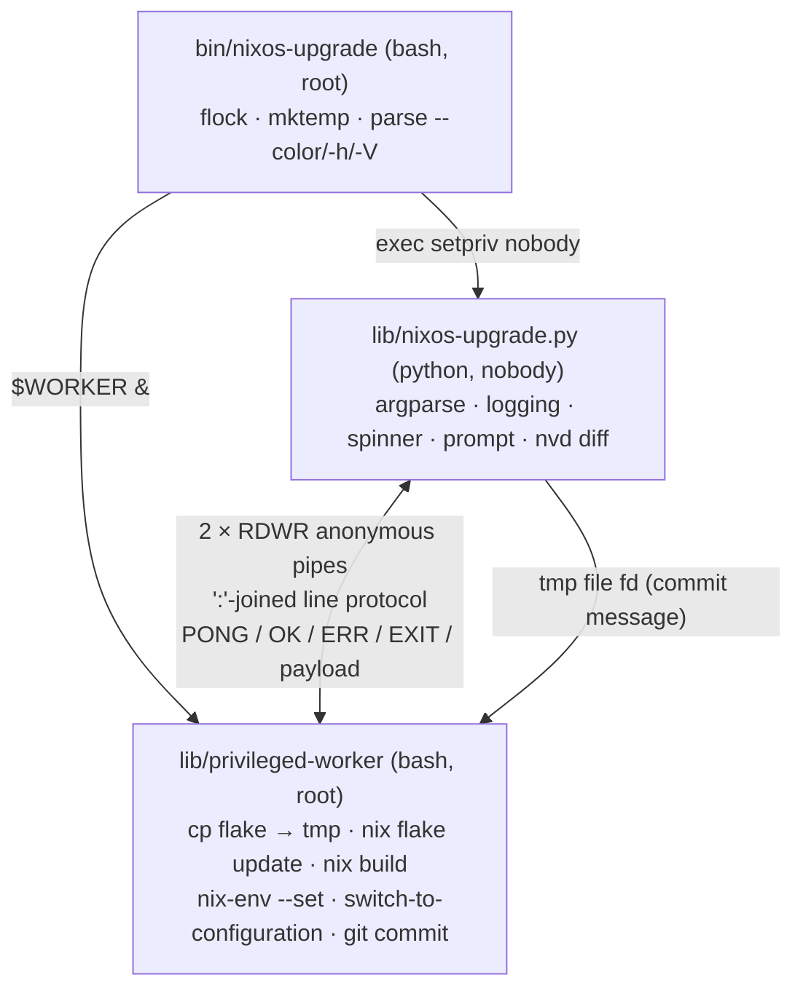

# Code & Architecture Review

Date: 2026-09-23
Branch: `agents/improvements` (based on `v1.0.5`)
Scope: everything under `src/`, `flake.nix`, docs and release process.

## Method

* Read every file in the repository.
* Ran `shellcheck`, `pyflakes`, `pycodestyle`, `mccabe`, `statix`, `deadnix`.
  All clean except the items noted below (`mccabe`: `run_cmd` = 15,
  `upgrade_system` = 12; `deadnix`: unused lambda args; `statix`: redundant
  parentheses).
* The tool itself cannot be run without root and a NixOS host, so every
  behavioural claim below is marked either
  * **verified** — reproduced in an isolated shell/Python repro of the exact
    mechanism (bash 5, Python 3.13, Nix 2.34.7, nixpkgs 26.05), or
  * **inferred** — follows from reading the code but was not executed.

## Architecture as it stands



Key observation: **almost everything with real consequences already runs as
root** (flake evaluation, build, profile switch, `switch-to-configuration`,
`git commit`). The unprivileged side is argparse, logging, yaspin, the y/n
prompt and `nvd diff`. The privilege boundary costs roughly 400 lines of
IPC and signal machinery, is the root cause of most findings in section A,
and protects very little.

---

## A. Correctness issues (highest severity first)

### A.1 `setup_tmp_dir` can delete the user's real git repository as root — verified

`src/lib/privileged-worker:116-122` copies the flake directory with
`cp --no-dereference` and then runs

```bash
rm --recursive "$(git -C "$TMP_DIR" rev-parse --absolute-git-dir)"
```

`--absolute-git-dir` resolves *through* the copy:

| Flake dir layout                                   | `rm -r` target                              |
|----------------------------------------------------|---------------------------------------------|
| plain `.git` directory                             | `$TMP_DIR/.git` (intended)                  |
| `.git` is a symlink (e.g. `/etc/nixos/.git → ~/dotfiles/.git`) | the **real** `.git` directory   |
| flake dir is a `git worktree` (`.git` is a `gitdir:` file) | `main/.git/worktrees/<name>` in the real repo |

How verified: built all three layouts, copied with the same `cp` flags,
printed the resolved path.

Minimal fix: `rm -rf "$TMP_DIR/.git"` (only the copied entry).
Better: do not copy the flake directory at all — see B.2.

### A.2 Ctrl‑C exits the UI but leaves `nix build` / `nix flake update` running as root — mechanism verified, consequence inferred

* `src/bin/nixos-upgrade:143` starts the worker with `$WORKER &` from a
  non‑interactive shell. POSIX/bash semantics: the async job gets
  SIGINT/SIGQUIT = `SIG_IGN`, and **every child inherits that** (`nix`,
  `git`, `cp`). Verified via `/proc/<pid>/status` `SigIgn` bits.
* Bash cannot `trap` a signal that was already ignored when the shell
  started, so the worker cannot undo this itself.
* `termination_signal_handler` (`nixos-upgrade.py:98-129`) only kills
  `running_subproc`, which is only ever `nvd`. Running as `nobody`, Python
  could not signal the root worker even if it tried.

Result: after Ctrl‑C the program prints "'Interrupt' signal received" and
exits, while the build continues invisibly to completion; a second
invocation meanwhile reports "process is already running".

### A.3 The RDWR anonymous-pipe trick never yields EOF — verified

`src/bin/nixos-upgrade:53-54`:

```bash
exec {PY_SH_FD}<><(:)
exec {SH_PY_FD}<><(:)
```

Each side holds a single fd opened read+write on the pipe, so the write end
is never fully closed and a reader never sees EOF (a plain unidirectional
pipe gives EOF immediately in the same test).

Consequences:

* If Python dies abnormally (SIGKILL, OOM), the root worker blocks in
  `read -u "$PY_SH_FD"` forever **while holding the `flock`** inherited via
  `LOCK_FD` → the tool is unusable until someone finds and kills the orphan.
* If the worker dies mid‑command, Python blocks forever in
  `readline_from_worker()`.
* The 1‑second PONG poll (`write_to_pipe_check`, `nixos-upgrade.py:656-670`)
  only covers "worker already dead before the command was sent".

### A.4 `errexit` makes the worker's error protocol dead code — verified

`src/lib/privileged-worker` uses `set -o errexit` (line 3), `trap on_error ERR`
(line 249) and `send_result` (lines 32‑38) that inspects `$?`.

* With `errexit`, any failing `test`/`nix`/`git` inside `parse_cmd` exits the
  shell **before** `send_result` runs.
* The `ERR` trap does **not** fire for failures inside functions unless
  `set -o errtrace` (`set -E`) is on. Verified: only the EXIT trap ran.

So every failure path currently works by accident: the EXIT trap writes
`EXIT`, Python compares against `"OK"`, and treats anything else as failure.
Side effects:

* Misleading messages, e.g. an evaluation error in `nix flake show` is
  reported as "flake: nixosConfigurations not found".
* The worker is gone after the first failure; `send_err`/`on_error` are
  effectively unreachable.

### A.5 Line-protocol fragility — verified / inferred

* `IFS="$CMD_IFS" read -ra` (`privileged-worker:252`) splits on `:` → any
  `--flake` path containing a colon is truncated; a newline breaks framing.
* `PONG`, status words and payload lines share one unframed channel.
* `readline()` on a non-blocking text stream can return a partial line
  (verified on 3.13: `'PON'`), so the PONG handshake is racy in principle
  (bash's 5‑byte write is atomic in practice, so this is latent).
* `readonly FLAKE_DIR` (`privileged-worker:90`) means a second
  `resolve_flake_dir` call kills the worker via `errexit`.

### A.6 Smaller Python bugs — verified

* `synsignals.PreserveHandler` (`synsignals.py:22-51`) is an `Enum` with
  **zero members**: functions defined in an Enum body become methods, not
  members. `PreserveHandler.AUTO` is a bare function that happens to work.
  Should be plain module-level functions / a `Callable` parameter.
* `nixos-upgrade.py:338-340`:
  `this_module.raiseExceptions = ...` sets an attribute on `__main__`;
  `logging.raiseExceptions` is never touched. Intended:
  `logging.raiseExceptions = __debug__`.
* `has_pkgs_changes` (`nixos-upgrade.py:498-502`) regexes the *coloured*
  diff — `\[.+\]` also matches the `[` inside ANSI escapes — whereas
  `count_changes` strips colours first. Replace with
  `self.count_changes().all > 0`.
* `-y/--assume-yes` and `-n/--assume-no` (`nixos-upgrade.py:256-263`) are not
  mutually exclusive; `-n` silently wins. Use
  `add_mutually_exclusive_group()`.
* `TERM_CORE_SIGS` (`bin/nixos-upgrade:23-45`) installs Python handlers for
  SIGSEGV/SIGBUS/SIGILL/SIGFPE and all real-time signals. A handler for a
  synchronous fault that returns simply re-faults; blocking those signals in
  `env --block-signal` is meaningless. Trim to HUP, INT, QUIT, TERM, PIPE
  (optionally ALRM/USR1/USR2).

### A.7 Auto-commit semantics — inferred (committer ident verified)

`privileged-worker:188-217`:

* `git commit --all` sweeps **all** modified tracked files in the repo
  (unrelated WIP included) but **not** untracked files — yet the deploy path
  (copy minus `.git` → Nix *path* fetcher) **does** deploy untracked files.
  The commit can therefore differ from the configuration that was switched to.
* `GIT_COMMITTER_EMAIL="<>"` yields the literal committer `nixos-upgrade <>`
  (verified in the commit object). Use e.g. `nixos-upgrade@<hostname>`.
* `runuser -u "$repo_owner"` keeps root's environment. If `sudo` resets
  `HOME`, git running as the owner cannot read the owner's `user.name` /
  `user.email` and the commit fails ("Please tell me who you are").

### A.8 Singleton lock is per store path — inferred

`check_singleton` (`bin/nixos-upgrade:115-122`) `flock`s the worker file
inside `/nix/store`, so two different *versions* of the tool can run
concurrently. Use a fixed path such as `/run/lock/nixos-upgrade.lock`.

---

## B. Architectural recommendations

### B.1 Move (or drop) the privilege boundary

Recommendation: one Python process running as root, driving everything via
`subprocess`; use `setpriv`/`runuser` *per command* only where it buys
something (`nvd diff` as `nobody`; `git commit` as the repo owner — already
done).

What this removes: `privileged-worker`, both pipes, PONG, `CMD_IFS`, the
duplicated `--color/-h/-V` parsing in bash, and most of `synsignals`.
What it fixes structurally: A.2, A.3, A.4, A.5 — children become signalable,
and exit codes / EOF come for free from `subprocess`.

If privilege separation is to be kept, the minimum hardening is:

* real unidirectional pipes (`coproc` or two FIFOs in `$TMP_DIR`) so EOF
  works;
* NUL-delimited framing (`read -d ''`) or base64 for arguments;
* drop `errexit` in the dispatcher (or `set -E` + explicit `if` per command)
  so `send_err` is actually reachable;
* a parent-liveness watchdog in the worker (`read -t 1` loop + `kill -0`);
* a `CANCEL` message the worker polls while long commands run in the
  background, so Ctrl‑C can reach `nix build`.

### B.2 Stop copying the flake directory, but choose source semantics explicitly

Nix 2.34 provides `--output-lock-file`, `--reference-lock-file` and
`--no-write-lock-file` (confirmed present in the installed `libnixcmd`). These
options control **which lock file is read or written**; they do not decide
whether the flake source is obtained through Git or directly from the
filesystem. That decision comes from the flake reference:

| Reference | Source files visible to Nix |
|-----------|-----------------------------|
| `/etc/nixos` (a raw path inside a Git repository) | Git-indexed files only. Modified tracked files are read from the current working tree, but merely untracked or `.gitignore`d files are not available. A new file becomes visible after it is added to the Git index (for example with `git add` or `git add --intent-to-add`). |
| `path:/etc/nixos` (an explicit `path:` reference) | The filesystem tree, including untracked and ignored files, subject to Nix's normal source filtering. |
| The current `$TMP_DIR` after copying the directory and removing its `.git` entry | A non-Git path tree, so it currently has the same broad "filesystem tree" behaviour as the explicit `path:` case. |

Therefore, the following example from the original review:

```bash
nix flake update --flake /etc/nixos --output-lock-file "$TMP/flake.lock"
nix build /etc/nixos#nixosConfigurations.$HOST.config.system.build.toplevel \
    --reference-lock-file "$TMP/flake.lock" --no-write-lock-file
```

**would use Git-indexed-file semantics**, because `/etc/nixos` is implicitly
resolved as a `git+file:` flake when it is inside a Git repository. Your
intuition is correct for modified tracked files: those changes are visible.
The important exception is a new file that has not been added to Git, or a
file excluded by `.gitignore`; Nix will not copy those into the source tree
used for evaluation. This is the same distinction that commonly affects
`nixos-rebuild --flake`.

The implementation in this branch selects the opposite, reproducible
policy: use the raw flake path and intentionally require new files to be
indexed by Git. The `nixos-upgrade` worker now passes the original
`$FLAKE_DIR` to Nix and uses a temporary lock file only to avoid modifying the
real lock during evaluation/build. The explicit `path:` alternative below is
still documented for comparison, but is not the selected behaviour.

If the intended behaviour were instead the old one — build the complete
directory including new local files — use an explicit path reference:

```bash
flake_ref="path:$FLAKE_DIR"
nix flake update --flake "$flake_ref" \
    --output-lock-file "$TMP/flake.lock"
nix build "$flake_ref#nixosConfigurations.$HOST.config.system.build.toplevel" \
    --reference-lock-file "$TMP/flake.lock" \
    --no-write-lock-file
```

This avoids the dangerous `git rev-parse --absolute-git-dir` deletion and
lets Nix create its normal store snapshot, but it has two trade-offs:

* The update and build are separate commands and can observe different
  filesystem contents if the flake changes between them. The current copy
  gives both operations one initial snapshot.
* Untracked and ignored files can be included, which preserves current
  behaviour but may copy large build artifacts or sensitive files into the
  Nix store. This should be intentional.

If a stable snapshot is more important than eliminating the copy, keep the
copy but remove only the copied metadata entry:

```bash
cp -R --no-dereference "$FLAKE_DIR/." "$TMP_DIR/"
rm -rf -- "$TMP_DIR/.git"
```

That fixes A.1 without changing the current all-files source semantics. A
more ambitious implementation could snapshot the source once and then use
that snapshot for both commands.

Finally, `--output-lock-file` means the update command does not modify the
real `flake.lock`, and the other two options prevent the build from writing
it. The application still decides when to install `$TMP/flake.lock`. In the
current code, `privileged-worker:180-182` copies the temporary lock file
**before** `switch-to-configuration` runs, not after a successful switch; if
that ordering matters, move the copy after the switch or add rollback logic.

### B.3 Drop the `nix flake show` pre-check

`check_nixos_config` (`privileged-worker:128-135`) evaluates **every** output
of the flake (slow on large flakes; fails on IFD, unfree packages, unrelated
broken outputs) just to grep for a string. Let `nix build` report the real
error, or `nix eval` the specific `…toplevel.drvPath`.

### B.4 Break up `CliProgram`

`nixos-upgrade.py` is a ~700-line class mixing argument parsing, logging and
colour setup, spinner management, signal handling, IPC client, subprocess
runner, nvd output parsing and the workflow. Natural seams:

| Module      | Responsibility                                            |
|-------------|-----------------------------------------------------------|
| `cli.py`    | argparse, option validation                               |
| `ui.py`     | logger, `ColorFormatter`, spinner, prompt                 |
| `nvd.py`    | diff parsing, `count_changes`, stats string (pure, testable) |
| `system.py` | nix / profile / git operations                            |
| `app.py`    | the six-step workflow                                     |

Replace the ~15 scattered `exit_with_error()` / `sys.exit()` calls with a
single `UpgradeError(code, msg)` raised from helpers and handled once in
`main()`. The current design is untestable because any helper can terminate
the process.

`run_cmd` (`nixos-upgrade.py:143-228`, complexity 15) polls a non-blocking
text stream every 100 ms and interleaves partial lines into stderr in debug
mode. With B.1 in place it can become a thin `subprocess.run` wrapper.

### B.5 Signals

`synsignals.py` is 150 lines of subtle mask/unmask logic to defer handlers
to "safe points". What the application actually needs is: on
HUP/INT/QUIT/TERM/PIPE — stop the spinner, terminate the child, exit
`128+n`. A plain handler that raises a custom exception plus `try/finally`
for cleanup would cover this with far less surface area. (Also see A.6 on
the signal list.)

### B.6 Spinner

The packaged yaspin (3.4.0) accepts `stream=sys.stderr`. The
`sys.stdout = sys.stderr` swapping in `get_spinner` / `spinner_start` /
`spinner_stop` (`nixos-upgrade.py:359-388`) can be removed; today any
`print()` while the spinner runs goes to stderr.

### B.7 Testing — currently none

* **NixOS VM test** (`pkgs.testers.runNixOSTest`): VM with a flake in
  `/etc/nixos`, run `nixos-upgrade -y`, assert the system profile changed
  and the commit exists. This project is an ideal fit and it is the only way
  to exercise the privileged path safely.
* **pytest** for the pure parts: `count_changes`, `get_changes_stat_str`,
  `ColorFormatter`, signal handling.
* **`checks.${system}`** in the flake so `nix flake check` runs shellcheck,
  pyflakes, pycodestyle and mccabe (they are already in the `pyFlakes` list
  but only pyflakes is used in `installCheckPhase`).

### B.8 Packaging (`flake.nix`)

* Extract a `callPackage`-style `package.nix` and expose `overlays.default`;
  have the NixOS module use `pkgs.nixos-upgrade`. Avoids pulling a second
  nixpkgs closure when users do not `follows`.
* Use `lib.mkEnableOption` / `lib.mkPackageOption` instead of
  `nullOr package` + `lib.optional` (`flake.nix:201-221`).
* Do not force `nix.settings.experimental-features` from the module
  (`flake.nix:217`); pass `--extra-experimental-features "nix-command flakes"`
  on the tool's own `nix` invocations instead.
* `systems` (`flake.nix:26-31`): drop Darwin. The tool needs
  `/run/current-system`, `nix-env --profile /nix/var/nix/profiles/system`,
  `switch-to-configuration`, `setpriv` and `flock`. It may evaluate on Darwin
  but cannot run there.
* `substituteInPlace --replace` → `--replace-fail` (nixpkgs 26.05 prints a
  deprecation warning for `--replace`; `-fail` also catches placeholder
  typos). Remove the dangling `\` line continuations in `preBuild`
  (`flake.nix:112, 120`).
* `dev = default.overrideAttrs (finalAttrs: prevAttrs: …)` → the attrset form
  `overrideAttrs { postBuild = …; }` (both args unused; `deadnix`).
  `statix`: redundant parentheses at `flake.nix:194` and `:219`.
* `buildInputs = runtimeInputs` (`flake.nix:141`) is unnecessary for a script
  package — the runtime closure comes from the substituted `PATH`.
* `pyFlakes` is a misleading name for "Python linters".
* `compileall -o 2` (`flake.nix:131`) output is unused by the `dev` variant
  (`-B -s` without `-OO` looks for non-optimised `.pyc`).
* Version: `dateVer` + `semVer` are kept in sync by hand across `flake.nix`,
  `CHANGELOG.md` and `RELEASE_CHECKLIST.md`. Consider a single `version`
  plus `self.shortRev` / `self.lastModifiedDate` for dev builds.

### B.9 CLI / UX

* Accept `--flake DIR[#NAME]` like `nixos-rebuild`; today the attribute is
  hostname-only (`nixos-upgrade.py:36-38`).
* Allow selective input updates (`nixos-upgrade nixpkgs home-manager`);
  today `nix flake update` always updates everything
  (`privileged-worker:137-140`).
* Make `--help` single-source: render the man page to plain text at build
  time and `cat` it, instead of `man --pager=cat … | head -n -4 | tail -n +3`
  (`bin/nixos-upgrade:82`).
* Accept `yes`, not only `y` (`nixos-upgrade.py:629`).
* README: `nix profile install` → `nix profile add`; "NixOs" → "NixOS".

---

## C. Nits

* `is_output_colored(self) -> (bool, bool)` is not a valid annotation
  (`tuple[bool, bool]`); `env_to_update: dict = {}` mutable default
  (`nixos-upgrade.py:317, 147`).
* `TERM_CORE_SIGS` spawns ~40 `kill -l` subshells on every start; make it a
  static list.
* `DROP_PRIV` (`bin/nixos-upgrade:20-21`): add `--no-new-privs` and
  `--bounding-set=-all` for cheap hardening.
* `process_diff` (`nixos-upgrade.py:540-541`) drops "the first 2 lines" of
  nvd output; comment the coupling to nvd's format.
* `OK` / `ERR` / `EXIT` / `PONG` are duplicated as literals on both sides of
  the protocol.

---

## Suggested order of work

1. **Safety fixes on this branch** (small, low risk, independent of the
   architecture decision):
   - [x] A.1 avoided by using the original Git worktree (Choice 3)
   - [x] A.6 `-y`/`-n` mutually exclusive
   - [x] A.6 `has_pkgs_changes` via `count_changes`
   - [ ] A.6 `logging.raiseExceptions`
   - [ ] A.6 `PreserveHandler` → plain functions
   - [ ] A.6 trim signal list
   - [ ] A.7 committer email
   - [ ] A.8 fixed lock path
   - [ ] B.8 `--replace-fail`, `systems` linux-only, `overrideAttrs` attrset
         form, statix/deadnix cleanups
2. **B.2 source semantics** — Choice 3 is selected and implemented; new
   files must be indexed by Git before Nix can use them.
3. **Decide the remaining architecture direction** — B.1 (root controller,
   recommended) vs. hardened IPC — since B.3–B.6 are shaped by that choice.
4. **Tests first** (B.7), especially the VM test, so the refactor has a
   safety net.
5. **Refactor** per B.1–B.6, then B.9 features.
