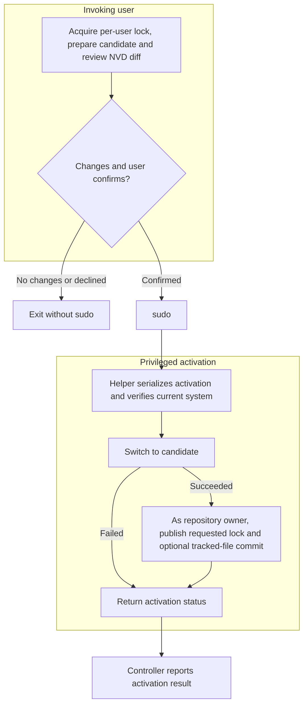

# Architecture

`nixos-upgrade` prepares a NixOS system upgrade as the invoking user and crosses
the privilege boundary only to activate a build the user has confirmed. This
guide is a maintainer overview; the implementation and tests define exact
behavior.

## Runtime flow

The launcher blocks the supported default-action signals while Python starts.
Python installs the application handlers before unblocking them. `synsignals`
defers their handling to safe points; `CommandRunner` terminates and reaps an
active child process group when appropriate. Signal handling stays deferred while
the privileged activation request runs, so the controller can read and report
the helper's result first.

## Components

| Component                                                                                                     | Responsibility                                                                                                                             |
| ------------------------------------------------------------------------------------------------------------- | ------------------------------------------------------------------------------------------------------------------------------------------ |
| [`src/bin/nixos-upgrade`](../src/bin/nixos-upgrade)                                                           | Set packaged runtime environment, block supported signals during Python startup, and `exec` the controller.                                |
| [`src/lib/nixos-upgrade.py`](../src/lib/nixos-upgrade.py)                                                     | Own startup/resource lifetime and orchestrate validation, preparation, diff presentation, confirmation, activation, and exit status.       |
| [`src/lib/cli_options.py`](../src/lib/cli_options.py)                                                         | Parse arguments into typed options and runtime defaults.                                                                                   |
| [`src/lib/console.py`](../src/lib/console.py) and [`src/lib/colorformatter.py`](../src/lib/colorformatter.py) | Handle terminal streams, prompts, logging, colors, and spinner behavior.                                                                   |
| [`src/lib/command_runner.py`](../src/lib/command_runner.py)                                                   | Run child processes, route output, and terminate/reap an active process group.                                                             |
| [`src/lib/nix_workflow.py`](../src/lib/nix_workflow.py) and [`src/lib/nvd.py`](../src/lib/nvd.py)             | Prepare a temporary lock file, run Nix update/build commands, compare closures, and interpret/format NVD changes.                          |
| [`src/lib/activation.py`](../src/lib/activation.py)                                                           | Construct the fixed sudo command, encode the activation request, and validate the helper result.                                           |
| [`src/lib/nixos-upgrade-activate`](../src/lib/nixos-upgrade-activate)                                         | Validate and serialize privileged activation; switch the system, then publish the lock file and optionally commit as the repository owner. |
| [`flake.nix`](../flake.nix) and [`package.nix`](../package.nix)                                               | Define flake outputs, packaging, the overlay and NixOS module, development environment, and checks.                                        |

## Privilege and process boundaries

- Option parsing, the per-user singleton lock in `XDG_RUNTIME_DIR`, Nix update
  and build, NVD comparison, diff display, and confirmation run as the invoking
  user. Nix commands do not run as root.
- Only an affirmative confirmation reaches `sudo`. The controller invokes the
  helper's fixed `activate` operation; it does not pass an arbitrary command to
  run as root. `activation.py` sends a structured JSON request on standard input
  and validates the helper's structured status result on standard output.
- The helper validates the requested store paths and checks that
  `/run/current-system` still matches the generation used for the build. A
  root-owned activation lock serializes system switches.
- The helper updates the system profile and runs `switch-to-configuration`
  before publishing `flake.lock` or attempting the optional repository commit.
  A lock-publication or commit failure after a successful switch is reported
  separately; it does not undo the system switch.
- The NixOS module does not install sudoers rules. The host's sudo policy must
  authorize the helper.

## Flake source and repository changes

The controller passes the resolved flake directory as a raw local path to Nix.
For a path inside a Git repository, Nix treats the source as a Git flake and
selects files indexed by Git: modified tracked files are visible, but untracked
and ignored files are not. Add new files to the Git index before upgrading. See
the [Nix manual's flake output attribute documentation](https://nix.dev/manual/nix/2.29/command-ref/new-cli/nix.html#flake-output-attribute).

Lock update and build are separate Nix invocations against the worktree. If
tracked source changes between them, they can observe different contents; the
application does not snapshot or lock the worktree between commands.

After a successful switch, auto-commit is enabled unless `--no-commit` is set.
The helper commits with `git commit --all` as the repository owner. This can
include any modified tracked files, not only files changed for the upgrade;
untracked files are not included.

## Validation pointers

Run `nix flake check` for the project checks. Relevant focused coverage includes:

- [`tests/test_confirmation.py`](../tests/test_confirmation.py) and
  [`tests/test-user-workflow.sh`](../tests/test-user-workflow.sh): confirmation,
  workflow ordering, and avoiding sudo on decline, no-change, or build failure.
- [`tests/sudo-activation-vm.nix`](../tests/sudo-activation-vm.nix): the real
  sudo/helper boundary, switch and failure ordering, lock publication, commits,
  and signal handling.
- [`tests/test-git-flake-source.sh`](../tests/test-git-flake-source.sh): verifies
  the CLI passes the raw flake path and isolated lock-file arguments. It does not
  test Nix's file-selection behavior; that behavior is described by the Nix
  manual linked above.
